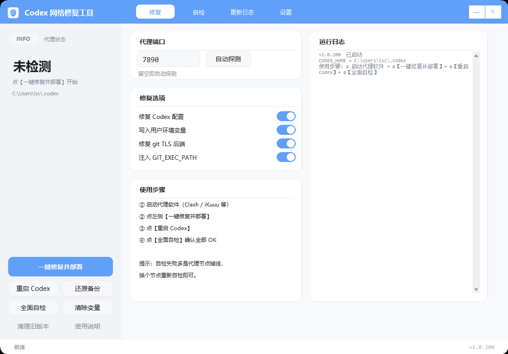
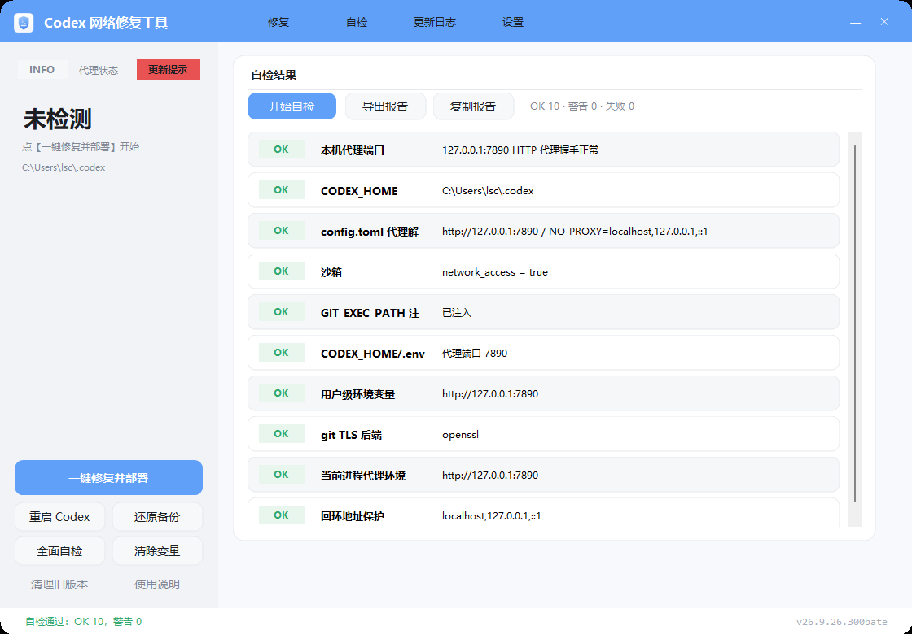
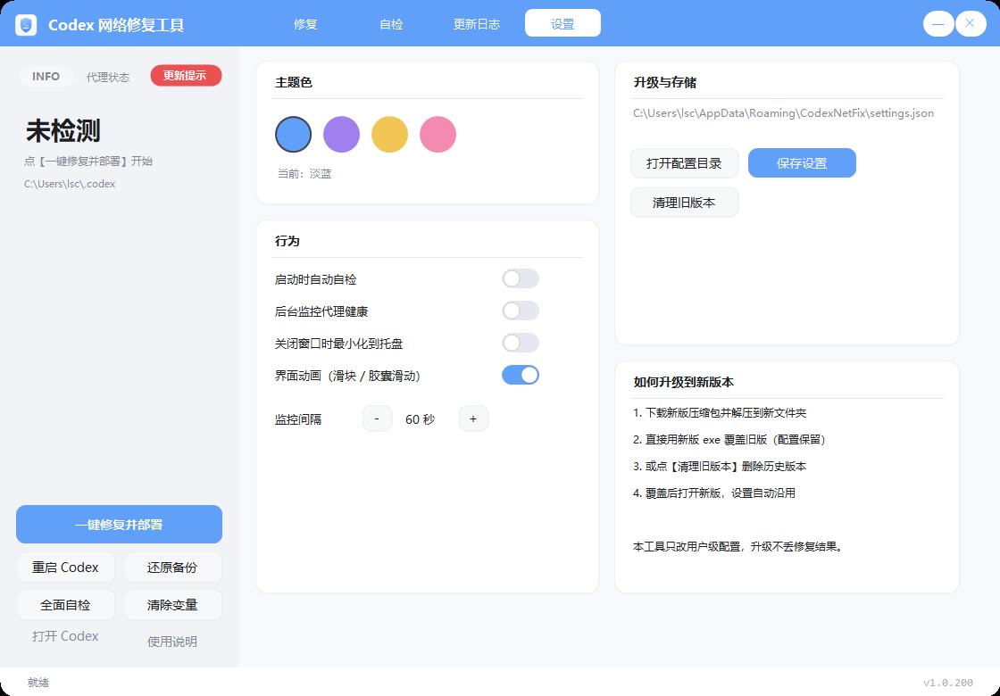
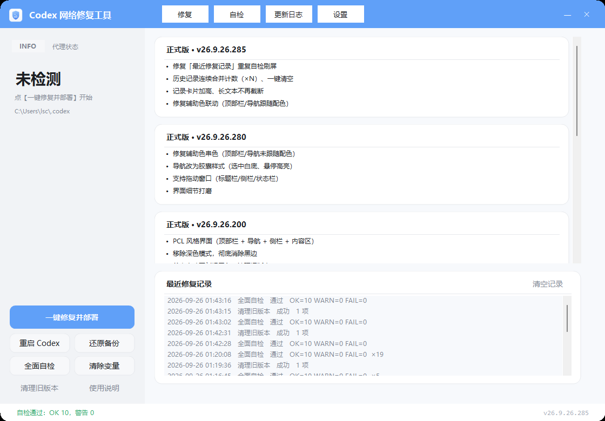
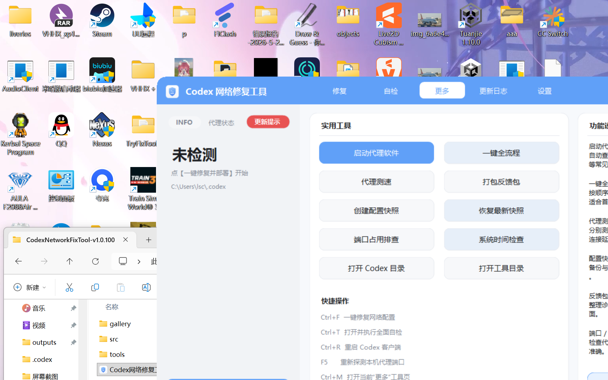

# Codex 网络修复工具 (Codex Net Universal Repair Toolbox)

> 一键修复 **Codex / ChatGPT 桌面版 / Codex CLI / IDE 插件** 在本机无法联网的问题。
> 自动探测本机代理、注入代理环境变量、修复配置、修复 git，并提供全面自检与一键回滚。




---

## 目录

- [为什么需要它](#为什么需要它)
- [功能特性](#功能特性)
- [界面预览](#界面预览)
- [快速开始](#快速开始)
- [命令行用法](#命令行用法)
- [工作原理](#工作原理)
- [目录结构](#目录结构)
- [从源码构建](#从源码构建)
- [常见问题](#常见问题)
- [贡献与许可](#贡献与许可)
- [English Summary](#english-summary)

---

## 为什么需要它

在 Windows 上，Codex 的沙箱默认**禁止非回环网络访问**，这会导致 Codex 内部执行命令时全部断网。实际排查中会遇到几类典型问题：

| 现象 | 真实原因 |
|---|---|
| Codex 里任何命令都连不上网 | 沙箱禁止非回环 socket，仅允许 `127.0.0.1` |
| 配了 `.env` 代理却完全没反应 | 禁网时 Codex 会注入**黑洞代理** `HTTP_PROXY=http://127.0.0.1:9`，而 dotenv 语义不覆盖已有变量 |
| 沙箱内 `git clone` 报 `'remote-https' is not a git command` | 运行时 git 的远程 helper 在 `mingw64\bin`，沙箱内 PATH 回退查找失效 |
| 沙箱内 git / curl 报 `schannel: SEC_E_NO_CREDENTIALS` | 沙箱 restricted token 拿不到 Windows 加密凭据 |
| 换了台电脑又要重新折腾 | 代理端口、git 路径、配置位置各不相同 |

本工具把上述修复全部自动化，并提供**自检**与**回滚**，避免手工改配置出错。

---

## 功能特性

- **一键修复并部署**：探测可用代理端口（TCP + `CONNECT` 握手 + 真实出网验证）→ 写入 Codex 配置 → 写入用户级环境变量 → 修复 git TLS
- **覆盖沙箱黑洞代理**：使用 `[shell_environment_policy.set]`（优先级高于 Codex 注入的 `127.0.0.1:9`）
- **修复沙箱内 git**：注入 `GIT_EXEC_PATH`（`git-core;mingw64\bin` 双目录），并把 git TLS 后端切到 `openssl`
- **11 项全面自检**：端口、出网、配置、环境变量、git、回环保护等，逐项给出结论与建议
- **一键回滚**：改动前自动备份（`*.bak-codexfix-*`），可完整还原（含删除工具新建的文件）
- **修复历史**：自动记录并合并重复项（`×N`），支持一键清空
- **更多实用工具**：自动发现并启动代理软件、一键全流程、代理测速、配置快照、反馈包、端口占用与系统时间检查
- **快捷键自定义**：总开关 + 逐项编辑，支持冲突检测、恢复默认、系统保留组合拦截
- **界面友好**：PCL 风格现代界面、无边框圆角窗口、四种主题色、托盘常驻、代理健康监控
- **可脚本化**：完整 CLI 子命令，便于批量部署
- **零依赖**：单文件 EXE，使用系统自带 .NET Framework 4.8 编译与运行，无需安装、无需管理员权限

---

## 界面预览

| 主界面（修复） | 自检结果 |
|---|---|
|  |  |

| 设置（主题色） | 更新日志 |
|---|---|
|  |  |

| 更多工具 |
|---|
|  |

| 快捷键设置 |
|---|
|  |

---

## 快速开始

1. 启动你的代理软件（Clash / Clash Verge / v2ray / iKuuu 等），确认节点可用
2. **在资源管理器里双击** `Codex网络修复工具.exe`（不要从 Codex 终端启动，沙箱会隔离权限）
3. 点左侧 **【一键修复并部署】**，完成后点 **【重启 Codex】**
4. 点 **【全面自检】**，全部 `OK` 即修复完成

> 想撤销：点【还原备份】即可回到修复前状态。

---

## 命令行用法

```powershell
Codex网络修复工具.exe --cli version        # 版本号
Codex网络修复工具.exe --cli detect         # 探测可用代理端口
Codex网络修复工具.exe --cli repair [端口]   # 一键修复（不带端口则自动探测）
Codex网络修复工具.exe --cli check  [端口]   # 全面自检
Codex网络修复工具.exe --cli e2e            # 端到端联网验证（沙箱内真实访问）
Codex网络修复工具.exe --cli rollback       # 还原备份
Codex网络修复工具.exe --cli restart-list   # 查看将受影响的 Codex 进程
Codex网络修复工具.exe --cli restart --yes  # 关闭并重启 Codex
Codex网络修复工具.exe --cli report out.txt # 导出诊断报告
Codex网络修复工具.exe --cli proxies         # 查找本机代理软件
Codex网络修复工具.exe --cli speed 7890      # 代理测速
Codex网络修复工具.exe --cli snapshot        # 创建配置快照
Codex网络修复工具.exe --cli restore         # 恢复最新配置快照
Codex网络修复工具.exe --cli feedback        # 生成反馈包
Codex网络修复工具.exe --cli port 7890       # 端口占用排查
Codex网络修复工具.exe --cli timesync 7890   # 系统时间检查
Codex网络修复工具.exe --cli hotkeys         # 查看快捷键设置
Codex网络修复工具.exe --cli hotkeys-disable # 关闭快捷键
Codex网络修复工具.exe --cli hotkeys-enable  # 开启快捷键
Codex网络修复工具.exe --cli hotkeys-reset   # 恢复默认快捷键
```

---

## 工作原理

### 1. 代理通道

Codex 沙箱禁止非回环 socket，但**允许 `127.0.0.1`**。因此把流量交给本机代理是唯一稳定通路。

工具会依次探测候选端口（系统代理设置 → 常见端口 → 由代理类进程监听的端口），并对每个候选端口执行：

1. TCP 可达性检查
2. HTTP `CONNECT` 握手（确认是 HTTP 代理）
3. 通过代理发起真实 HTTP 请求（确认**能真正出网**）

### 2. 覆盖黑洞代理

禁网状态下 Codex 会向子进程注入 `HTTP_PROXY=http://127.0.0.1:9`（不可用端口）让工具快速失败。
`dotenv` 语义**不覆盖已有环境变量**，所以放在 `$CODEX_HOME/.env` 里的代理常常"看起来没用"。
本工具写入 `[shell_environment_policy.set]`，其优先级高于该注入值：

```toml
[sandbox_workspace_write]
network_access = true

[shell_environment_policy.set]
HTTP_PROXY  = "http://127.0.0.1:<端口>"
HTTPS_PROXY = "http://127.0.0.1:<端口>"
ALL_PROXY   = "http://127.0.0.1:<端口>"
NO_PROXY    = "localhost,127.0.0.1,::1"
NODE_USE_ENV_PROXY = "1"
GIT_EXEC_PATH = '<git-core>;<git\mingw64\bin>'
```

### 3. git 相关修复

- `GIT_EXEC_PATH`：让 git 在沙箱内也能找到 `git-remote-https`
- `http.sslBackend = openssl`：绕开沙箱内 schannel 取不到凭据的问题（写入 `~/.gitconfig`）

---

## 目录结构

```
.
├─ src/                        # C# 源码与构建脚本
│  ├─ Program.cs               # 界面 + 命令行入口
│  ├─ Core.cs                  # 探测 / 修复 / 自检 / 回滚 / 重启引擎
│  ├─ Theme.cs                 # 主题调色板与自绘圆角控件
│  ├─ Settings.cs              # 设置持久化、修复历史、版本日志
│  ├─ AppIcon.cs               # 图标绘制与多尺寸 ICO 封装
│  ├─ AssemblyInfo.cs
│  └─ build.ps1                # 一键构建（离线，无需依赖）
├─ tools/
│  ├─ selftest.ps1             # 自动化验收（23 项，含真实联网）
│  └─ stress-test.ps1          # 极端场景测试（38 项：异常输入/权限/损坏配置等）
├─ assets/
│  ├─ app.ico
│  ├─ icon-preview.png
│  └─ screenshots/             # 界面截图
├─ docs/
│  ├─ USAGE.md                 # 详细使用说明
│  ├─ FAQ.md                   # 常见问题
│  └─ GITHUB_PUBLISH.md        # 发布信息（描述 / 标签 / Release 模板）
├─ .github/workflows/build.yml # CI：Windows 构建 + 产物上传
├─ CHANGELOG.md
├─ CONTRIBUTING.md
└─ LICENSE
```

---

## 从源码构建

**环境要求**：Windows 10/11 + .NET Framework 4.8（系统自带，无需额外安装）

```powershell
powershell -ExecutionPolicy Bypass -File src\build.ps1
```

产物输出到仓库根目录：`Codex网络修复工具.exe`

---

## 测试 / Testing

仓库内置两套脚本（都会在结束时自动还原现场）：

```powershell
# 1) 自动化验收：23 项（含沙箱内真实 git clone / HTTPS / 本地服务验证）
powershell -ExecutionPolicy Bypass -File tools\selftest.ps1 -TestGitConfig

# 2) 极端场景测试：38 项（无效端口、非数字端口、只读文件、损坏 TOML、中文/空格路径、
#    幂等性、备份回滚、无备份回滚、无 git 环境、历史文件损坏、报告/图标生成等）
powershell -ExecutionPolicy Bypass -File tools\stress-test.ps1
```

当前版本实测结果：**23/23 与 38/38 全部通过**。

---
## 常见问题

请见 [docs/FAQ.md](docs/FAQ.md)。几个高频问题：

- **提示"当前很可能运行在 Codex 沙箱内"** → 请在资源管理器中双击运行，不要从 Codex 终端启动
- **修复后自检仍提示需要重启** → 环境变量只对新进程生效，请完全退出并重启 Codex（或点【重启 Codex】）
- **自检显示网络失败** → 看探针输出：`502` / `TLS EOF` 通常是**代理节点临时掉线**，换节点后重新自检

---

## 作者有话说

> 这是一名 15 岁高中生使用 **DeepSeek V4.1 Flash** 制作的一个小工具，会持续更新该工具。
> 可能有些地方 bug 很多，但我会努力学习完善的，未来还会制作更多的工具，感谢大家的支持！
>
> 由于高中学业紧张、住宿半月放假，来不及回复消息，大家可以加入**技术反馈 QQ 群：783904560** 共同探讨与反馈问题。

---
## 贡献与许可

- 欢迎提交 Issue / PR，请先阅读 [CONTRIBUTING.md](CONTRIBUTING.md)
- 开源许可：[MIT](LICENSE)

---

## English Summary

**Codex Network Repair Tool** — a Windows utility that fixes network connectivity for Codex / ChatGPT desktop / Codex CLI / IDE extension.

The Codex sandbox blocks non-loopback sockets and injects a black-hole proxy (`127.0.0.1:9`), which breaks all network access inside Codex. This tool:

1. Detects a working local proxy port (TCP + `CONNECT` + real egress test)
2. Writes `[shell_environment_policy.set]` into `$CODEX_HOME/config.toml` (overrides the black-hole proxy) plus `.env`
3. Writes user-level proxy environment variables and fixes git (`GIT_EXEC_PATH`, `http.sslBackend=openssl`)
4. Provides an 11-item self-check, one-click rollback, repair history and a tray monitor

**Zero dependencies** — single-file EXE built with the system .NET Framework 4.8 compiler, no installer, no admin rights required.

License: MIT
